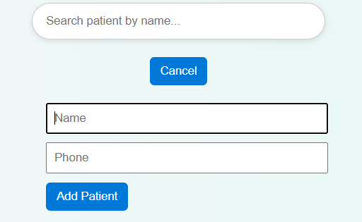

# Patient Dashboard

A responsive React dashboard to manage patient records with search, add new patient, and view details. Built with React, Vite, and CSS.
## Features

- Landing page with Navbar
- Display patient list from JSONPlaceholder API
- Search patients by name
- View patient details in modal
- Add new patient (local state)
- Responsive design for desktop & mobile
- Loading & error states while fetching API
  
## Setup Instructions

1. Clone the repository: https://github.com/vaishalis29/Patient_Dashboard.git

## Screenshots

### Landing Page

### Patient List

### Add New Patient

## Live Demo

[View Patient Dashboard](https://patient-dashboard-tau.vercel.app/)
